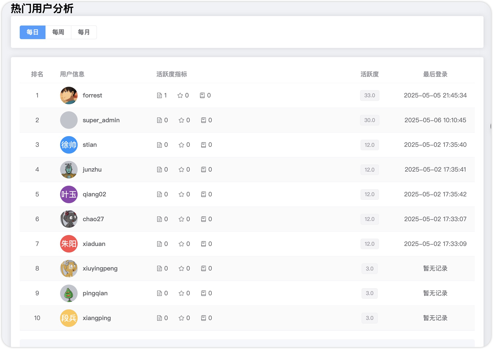
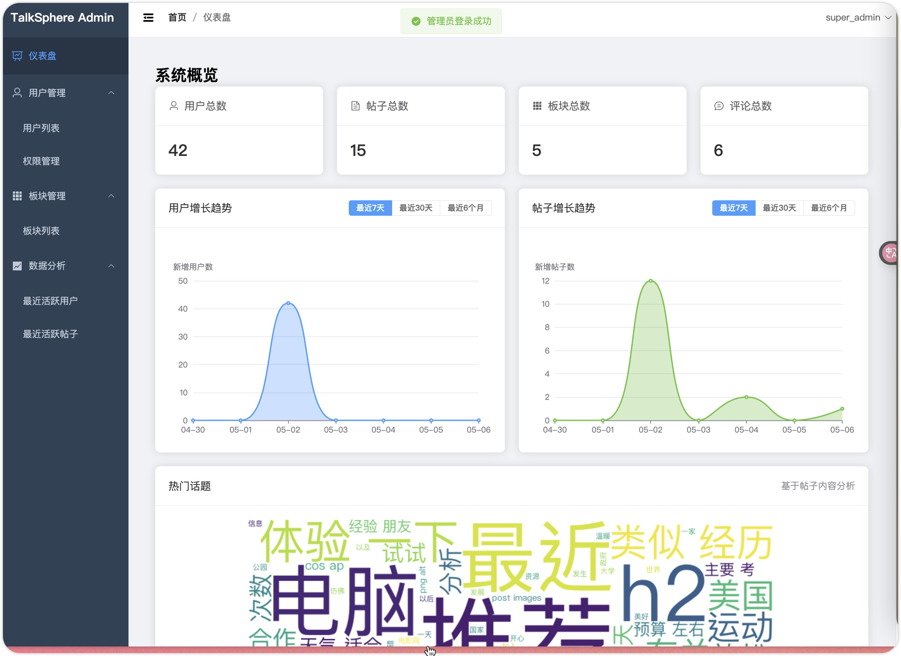

# TalkSphere 🌐

<div align="center">

[](https://golang.org)
[](https://vuejs.org)
[](LICENSE)
[](http://makeapullrequest.com)

</div>

> 🚀 一个现代化的社区论坛系统，专注于用户体验和功能丰富性

## ✨ 特色功能

### 👥 用户系统
- 🔐 安全的用户认证（注册、登录、登出）
- 👤 个性化资料管理（头像、个人简介）
- 🛡️ 基于 RBAC 的权限管理
- 👑 多角色支持（普通用户、管理员、超级管理员）

### 📝 内容管理
- 📋 多板块内容分类
- 📝 富文本编辑器支持
- 🖼️ 多图片上传功能
- ✏️ 帖子 CRUD 操作
- 💬 树形评论系统

### 🤝 社交互动
- 👍 帖子点赞/取消点赞
- 💭 评论点赞/取消点赞
- ⭐ 帖子收藏功能
- 🔔 用户关注系统

### 🔍 搜索功能
- 📊 智能内容搜索
- 👥 用户信息检索
- 🎯 多维度模糊匹配

### 📊 数据分析
- 📈 用户活跃度分析
- 📊 内容增长趋势图
- 🏆 热门帖子排行
- ☁️ 内容词云可视化

## 🛠️ 技术栈

### 后端技术
- 🔧 Go 1.23.1
- 🌐 Gin Web Framework
- 💾 GORM + MySQL
- 📦 Redis 缓存
- 🔒 Casbin 权限控制
- 🎟️ JWT 认证
- ☁️ 腾讯云 COS 对象存储

### 前端技术
- 🎨 Vue.js 3.x
- 🎯 Element Plus UI
- 🔄 Axios HTTP 客户端
- 🛣️ Vue Router
- 🗃️ Vuex 状态管理

## 🚀 快速开始

### 环境要求
- Go 1.23.1+
- Docker & Docker Compose
- Node.js 16+
- npm 8+

### 🐳 数据库部署

1. 使用 Docker Compose 启动 MySQL
```bash
cd backend/deploy
docker-compose up -d
```

MySQL 将以以下配置启动：
- 端口: 3306
- 数据库: TalkSphere
- 用户名: forrest
- 密码: 571400yst
- Root 密码: root

数据库配置说明：
```yaml
volumes:
  - ./mysql/data:/var/lib/mysql           # 数据持久化
  - ./mysql/conf:/etc/mysql/conf.d        # 配置文件
  - ./mysql/init:/docker-entrypoint-initdb.d  # 初始化SQL脚本

配置参数：
  - 默认认证插件: mysql_native_password
  - 字符集: utf8mb4
  - 排序规则: utf8mb4_general_ci
  - 表名大小写不敏感: lower_case_table_names=1
```

### 🔧 后端部署

1. 克隆项目
```bash
git clone https://github.com/yourusername/TalkSphere.git
cd TalkSphere/backend
```

2. 安装依赖
```bash
go mod tidy
```

3. 确认配置文件
```bash
# 检查配置文件中的数据库连接信息是否与 Docker Compose 中的配置匹配
vim conf/config.yaml
```

配置示例：
```yaml
mysql:
  host: "127.0.0.1"
  port: 3306
  user: "forrest"
  password: "571400yst"
  db: "TalkSphere"
  max_open_connection: 20
  max_idle_connection: 10
```

4. 启动服务
```bash
go run main.go
```

### 🎨 前端部署

1. 进入前端目录
```bash
cd ../frontend
```

2. 安装依赖
```bash
npm install
```

3. 开发环境运行
```bash
npm run serve
```

4. 生产环境构建
```bash
npm run build
```

## 📁 项目结构

```
TalkSphere/
├── 📂 backend/                # 后端代码
│   ├── 📄 conf/              # 配置文件
│   ├── 📄 controller/        # 控制器
│   ├── 📄 middleware/        # 中间件
│   ├── 📄 models/           # 数据模型
│   ├── 📄 pkg/              # 公共包
│   └── 📄 router/           # 路由
├── 📂 frontend/             # 前端代码
│   ├── 📄 public/          # 静态资源
│   └── 📄 src/             # 源代码
└── 📂 doc/                 # 文档
```

## 📷 功能展示

### 首页


### 数据分析


### 内容管理


## 👥 开发团队

- 👨‍💻 [@taooooooooooooooo](https://github.com/forrestIsRunning) - 项目负责人

## 📄 许可证

本项目采用 [MIT](LICENSE) 许可证。

## 🤝 贡献指南

1. Fork 本仓库
2. 创建特性分支 (`git checkout -b feature/AmazingFeature`)
3. 提交更改 (`git commit -m 'Add some AmazingFeature'`)
4. 推送到分支 (`git push origin feature/AmazingFeature`)
5. 提交 Pull Request

## 🌟 致谢

感谢所有为本项目做出贡献的开发者！

---

<div align="center">

**TalkSphere** ©2025 Created by [@taooooooooooooooo](https://github.com/forrestIsRunning)

</div>