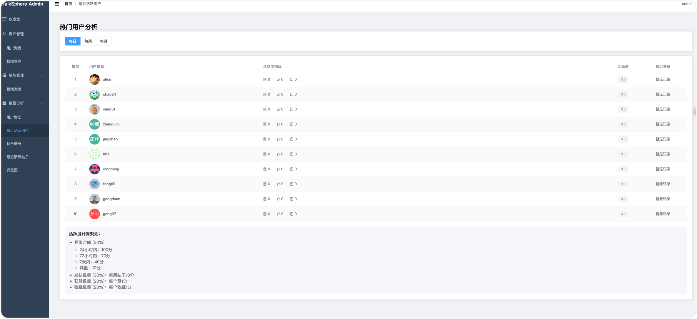
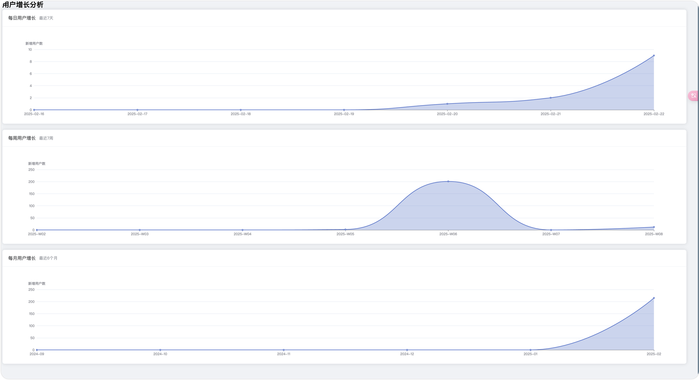
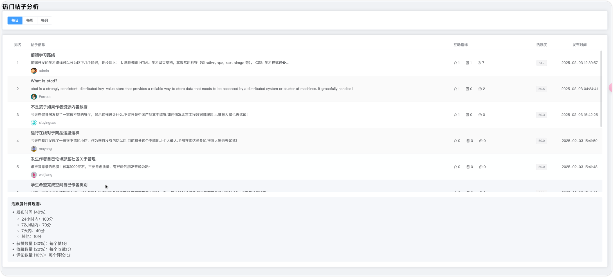
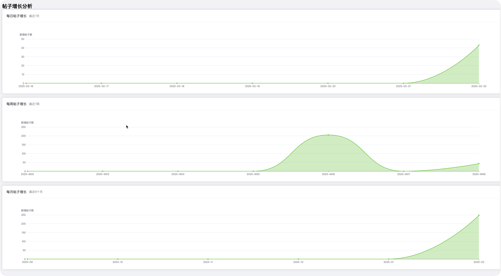

## TalkSphere

### **1. 用户模块**

- **注册**：用户可以创建账号。
- **登录**：用户可以通过账号密码进行登录。
- **登出**：用户可以退出当前会话。
- **RBAC权限分配**：不同角色的用户具有不同的权限，如普通用户、管理员等，使用角色基于访问控制（RBAC）来管理权限。

### **2. 板块管理模块**

- **板块管理**：管理论坛的不同板块，每个板块可以承载不同主题的帖子，管理员可以新增、修改或删除板块。

### **3. 帖子模块**

- **发表帖子**：用户可以发表带有图片和文字的帖子，内容可以包括图片、文字、链接等多种格式。

### **4. 互动模块**

- **评论**：帖子下方允许用户进行评论，支持树形结构的评论展示，即评论可以嵌套和回复。
- **点赞**：用户可以对帖子或评论进行点赞。
- **收藏**：用户可以收藏自己喜欢的帖子，以便以后查看。

### **5. 榜单模块**

- **排行榜**：展示基于某些数据（如点赞数、评论数等）和算法计算的实时榜单（例如 Top 10 最受欢迎的帖子）。

### **6. 模糊搜索模块**

- **帖子搜索**：用户可以通过关键字搜索帖子，支持模糊搜索，返回相关帖子列表。

### **7. 数据可视化模块**

- **数据展示**：将论坛的各种数据（如用户活跃度、帖子数量、点赞数等）通过图表或其他方式进行可视化，帮助管理员或用户分析数据趋势。

---

## timeLine

- 2025.1.3 
  - 项目前端、后端骨架搭建
  - 登陆、注册前后端连调
- 2025.1.4
  - 实现JWT
  - 对接腾讯OSS，实现bucket创建和object的获取、删除、更新操作
  - 实现用户头像上传，bio更新
  - 表结构设计；简化业务
  - fix 登陆后，跳转forum失败问题
- 2025.1.5
  - 表结构设计
  - 业务功能设计
  - 板块模块的CRUD
  - 使用casbin完成 用户RBAC
- 2025.1.8
  - fix JWT
  - 帖子模块
    - 用户发表帖子
    - 根据id获取帖子详情
    - 根据id删除帖子
    - 根据id更新帖子
    - 获取某用户的所有帖子
    - 获取某板块下的所有帖子
- 2025.1.9
  - 交互模块
    - 评论
      - 根评论
      - 子评论
    - 点赞
      - 给贴子点赞
      - 给用户评论点赞
    - 收藏帖子
- 2025.1.10
  - 前端
    -用户发表帖子
    - 按照板块查看帖子列表
    - 查看帖子详情
    - 给帖子点赞、收藏、阅读量增加
- 2025.2.2
  - 后端
    - 提供casbin用户鉴权接口，判断userid对应的用户是否有admin权限 /user/check
    - 提供查询用户总数、帖子总数、板块总数后端接口
    - 提供用户列表接口
    - 实现模糊搜索，可以按照用户名、ID、邮箱信息、个人简介来进行模糊搜索，查询对应的用户
  - 前端
    - 提供admin登陆页面
    - adminHome页面实现实现板块的增删改查
    - adminHome页面实现用户列表的展示
    - adminHome页面实现模糊搜索，可以按照用户名、ID、邮箱信息、个人简介来进行模糊搜索，查询对应的用户
- 2025.2.3
  - 前端
    - 帖子创建时支持富文本创建
    - 帖子创建时支持多图片上传
    - 帖子列表展示时，显示第一张图片在右边
    - 帖子详情中的作者名称fix
    - 支持帖子评论嵌套评论
    - 支持用户和帖子内容的模糊查询
  - 数据制造
    - 制造用户数据
    - 制造帖子数据
- 2025.2.4
  - 支持用户查看自己点赞的帖子
  - 支持用户查看自己收藏的帖子
  - 支持用户查看自己发表的帖子
  - 支持用户查看自己评论的帖子
  - fix admin登陆不久后，自动登出问题
  - 前端界面 用户注册需要验证密码和再次输入密码的一致性
  - adminHome支持权限的分配，admin用户可以分配xxx普通用户admin的权限
  - 支持用户以富文本的格式写帖子 TOOD
  - 模糊搜索框置顶
  - 右边的滚动条设置为透明
  - fix图片渲染问题
- 2025.2.5
  - 榜单模块（展示基于某些数据（如点赞数、评论数等）和算法计算的实时榜单（例如 Top 10 最受欢迎的帖子））
- 2025.2.6
  - 数据分析的内容
- 2025.2.21
  - 数据分析
    - 用户分析
      - 以发帖数、帖子点赞数、帖子阅读数为指标，天、周、月活跃用户的姓名、头像信息展示

      - 【折线图📈】 每天增长用户量、每周增长用户量、每月增长用户量

    - 帖子分析
      - 以【阅读数】、【点赞数】、【收藏数】、【创建时间先后顺序】等指标构建的帖子

      - 【折线图📈】每天增长帖子量、每周增长帖子量、每月增长帖子量

      - 词图云
